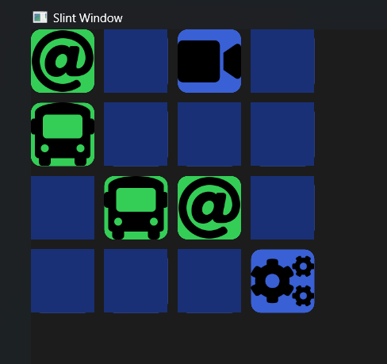

# **Card Game Memory (Rust) :crab:**

This tutorial, for building a memory game in **RUST**, is provided by the **Slint GUI Framework** official page, which **must** be visited <a href="https://slint.dev/">here</a>

**Slint GUI** is awesome, and reveals use cases in: embedded, Desktop apps, Industrial, Automotive...  

The game consists of a grid of 16 rectangular tiles, clicking on tile uncovers an icon underneath. Each tile has a sibling somewhere in the grid...  
Final objective is to connect all icons pairs. 
Uncovering two tiles disable for few millisecs the entire game, in order for the user to not be able to uncover more than two tiles at a time...

## **Installation - Prerequisites**

- Windows, MacOS, or Linux operating system
- Rust installed on your system (along with cargo)

As usual, you can git clone this repository, navigate to the clone folder, and simply run `cargo build` to build the executable, followed by `cargo run` to run the game and test the RAM of your brain !

If you do not have Rust installed on your system, please refer to the official documentation, according to your OS on <a href="https://www.rust-lang.org/tools/install">this page</a>

This little GUI Game is intended to work on any platform you're using, whether \*NIX flavored or Windows.

## **Example**

Here's a screenshot of the launched game:  
 

